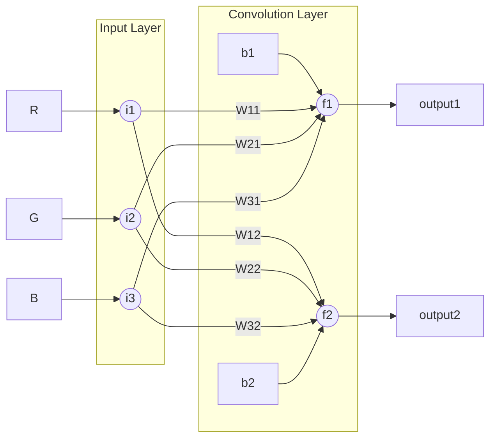

# CNNs - Convolution


Convolutions are performed between filters (known as convolutional kernels) and input data. Filters (or kernels) and input data can be represented as matrices. 

First, the kernel hovers over the input data matrix to obtain a matrix with the same shape as the kernel. After that, a [Hadamard product](https://en.wikipedia.org/wiki/Hadamard_product_(matrices)) between the kernel and the matrix got from the input data is applied to obtain a new product matrix. Then, all elements in the product matrix are summed with a bias to obtain an output number. Continuing to slide the kernel over the input data matrix from left to right and then from top to bottom, the matrix Hadamard production and summation is repeated to obtain more output numbers. Finnaly, all output numbers are combined into a new output matrix.


### Example


([Flowcharts - Basic Syntax](https://mermaid.js.org/syntax/flowchart.html))

Input data R, G, B are 5x5 matrices.

```sh
R:             G:             B:
[[1,0,1,0,1],  [[0,1,2,3,4],  [[3,3,3,3,3],
 [0,1,0,1,0],   [5,6,7,8,9],   [3,2,2,2,3],
 [1,0,1,0,1],   [9,8,7,6,5],   [3,2,1,2,3],
 [0,1,0,1,0],   [0,1,2,3,4],   [3,2,2,2,3],
 [1,0,1,0,1]]   [5,6,7,8,9]]   [3,3,3,3,3]]
```

Filters (or convolutional kernels) are 3x3 matrices
```sh
W11=W21=W31:    W21=W22=W32:
[[1,1,0],       [[0,0,1],
 [1,1,0],        [0,0,2],
 [0,0,2]]        [0,1,2]]
```

Bias `b1=1` and `b2=2`

Then To get output data matrices

```sh
output1 = (R conv W11) + (G conv W21) + (B conv W31) + b1
output2 = (R conv W12) + (G conv W22) + (B conv W32) + b2
```

Solve it by using [torch.nn.functional.conv2d](https://saturncloud.io/blog/a-comprehensive-guide-to-convolutional-neural-networks-the-eli5-way/)

```python
import torch
import torch.nn.functional as F

R = [[1,0,1,0,1],
 [0,1,0,1,0],
 [1,0,1,0,1],
 [0,1,0,1,0],
 [1,0,1,0,1]]
G = [[0,1,2,3,4],
 [5,6,7,8,9],
 [9,8,7,6,5],
 [0,1,2,3,4],
 [5,6,7,8,9]]
B = [[3,3,3,3,3],
 [3,2,2,2,3],
 [3,2,1,2,3],
 [3,2,2,2,3],
 [3,3,3,3,3]]

W11 = W21 = W31 = [[1,1,0],
 [1,1,0],
 [0,0,2]]
W12 = W22 = W32 = [[0,0,1],
 [0,0,2],
 [0,1,2]]

input = torch.tensor([[R, G, B]])
weight = torch.tensor([[W11, W21, W31],[W12, W22, W32]])
bias = torch.tensor([1,2])
F.conv2d(input, weight, groups=1, stride=1, bias=bias)

# output
# tensor([[[[44, 45, 51],
#           [49, 50, 52],
#           [53, 50, 54]],
# 
#          [[54, 55, 60],
#           [41, 45, 52],
#           [50, 55, 62]]]])
```

Calculate the output data shape

```
[(W-K+2P)/S]+1
```
- W: input size
- K: Filter (kernel) size
- S: Stride
- P: padding


Read more:

- https://medium.com/@mayank___17/layers-of-neural-networks-54cf2c895c30
- https://medium.com/@mayank___17/what-is-an-artificial-neural-network-ee35b99f3d37
- https://saturncloud.io/blog/a-comprehensive-guide-to-convolutional-neural-networks-the-eli5-way/
- https://towardsdatascience.com/covolutional-neural-network-cb0883dd6529
- https://stackoverflow.com/questions/53580088/calculate-the-output-size-in-convolution-layer
- https://training.galaxyproject.org/training-material/topics/statistics/tutorials/CNN/tutorial.html
